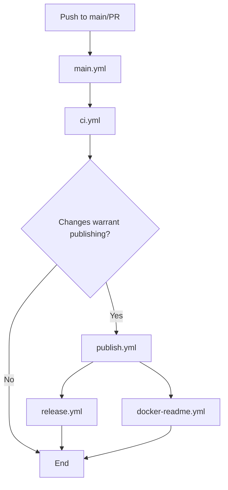

# GitHub Actions Workflows

This directory contains modular GitHub Actions workflows for the IT Tools MCP Server project.

## Workflow Structure

### 🔄 Main Workflows

- **`main.yml`** - Main orchestration workflow that coordinates all other workflows
- **`ci.yml`** - Continuous Integration (build, test, analyze changes)
- **`publish.yml`** - Publish to Docker Hub and NPM
- **`release.yml`** - Create GitHub releases
- **`docker-readme.yml`** - Update Docker Hub README

### 🛠️ Utility Workflows

- **`version-bump.yml`** - Manual version bumping and changelog management

## Workflow Flow

## Triggers

### Automatic Triggers

- **Push to main/master**: Runs full CI/CD pipeline if code changes are detected
- **Pull Request**: Runs CI only (build and test)
- **Tag push**: Runs full pipeline regardless of changes
- **README changes**: Updates Docker Hub README only

### Manual Triggers

- **Version Bump**: Use `version-bump.yml` to increment version and trigger release
- **Manual Deploy**: Use `main.yml` with custom inputs for specific scenarios
- **Force Release**: Use `release.yml` directly to create releases
- **README Update**: Use `docker-readme.yml` to update Docker Hub description

## Secrets Required

The following secrets must be configured in your repository:

- `DOCKER_USERNAME` - Docker Hub username
- `DOCKER_PASSWORD` - Docker Hub password or access token
- `NPM_TOKEN` - NPM authentication token
- `GITHUB_TOKEN` - Automatically provided by GitHub

## Usage Examples

### Creating a New Release

1. **Automatic**: Push changes to main - if code changed, it will auto-release
2. **Manual**: Use the "Version Bump and Release" workflow in GitHub Actions tab
3. **Force**: Use the "Create GitHub Release" workflow with force option

### Publishing Only

Use the "Build and Deploy" workflow with "Skip publishing" unchecked.

### Updating Documentation

Push changes to `README.dockerhub.md` - it will automatically update Docker Hub.

## Benefits of This Structure

- **Modular**: Each workflow has a single responsibility
- **Reusable**: Workflows can be called from other workflows or repositories
- **Maintainable**: Easy to debug and modify individual components
- **Flexible**: Can run workflows independently or as part of the main pipeline
- **Efficient**: Avoids unnecessary work (e.g., skip publishing for docs-only changes)
