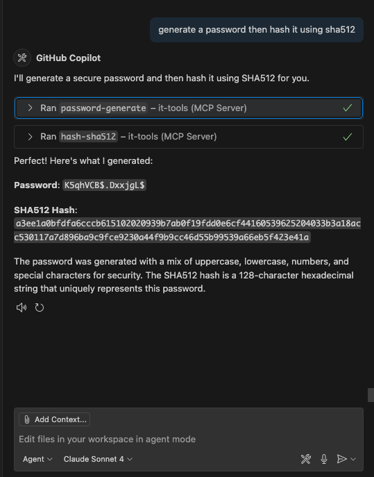
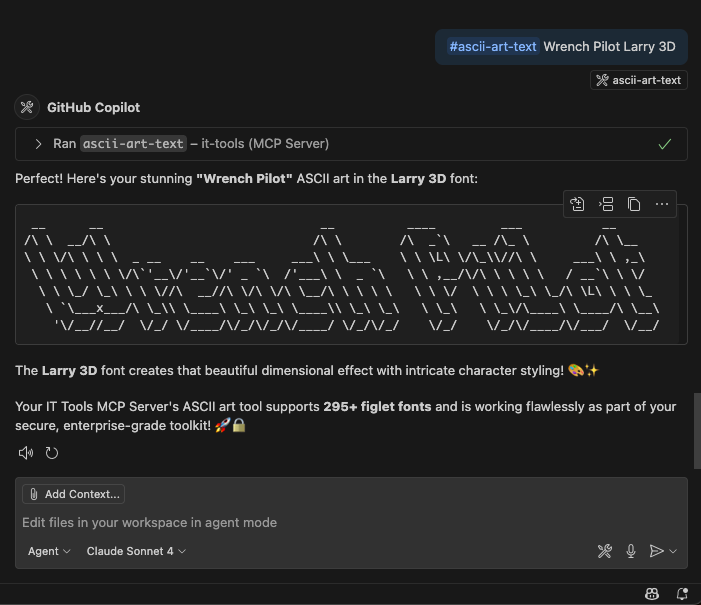

# IT Tools MCP Server

[](https://hub.docker.com/r/wrenchpilot/it-tools-mcp)
[](https://hub.docker.com/r/wrenchpilot/it-tools-mcp)
[](https://github.com/wrenchpilot/it-tools-mcp/actions)

> **📝 Note**: A condensed version of this README is automatically synced to [Docker Hub](https://hub.docker.com/r/wrenchpilot/it-tools-mcp) due to character limits.

A comprehensive Model Context Protocol (MCP) server that provides access to 87 IT tools and utilities commonly used by developers, system administrators, and IT professionals. This server exposes a complete set of tools for encoding/decoding, text manipulation, hashing, network utilities, and many other common development and IT tasks.

[](https://glama.ai/mcp/servers/@wrenchpilot/it-tools-mcp)

## 📦 Installation & Setup

### Using with VS Code

Add to your VS Code `settings.json`:

#### Node

```json
{
  "mcp": {
    "servers": {
      "it-tools": {
        "command": "npx",
        "args": [
          "-y",
          "wrenchpilot/it-tools-mcp"
        ],
        "env": {}
      }
    }
  }
}
```

#### Docker

```json
{
  "mcp": {
    "servers": {
      "it-tools": {
        "command": "docker",
        "args": [
          "run",
          "-i",
          "--rm",
          "--init",
          "--security-opt", "no-new-privileges:true",
          "--cap-drop", "ALL",
          "--read-only",
          "--user", "1001:1001",
          "--memory=256m",
          "--cpus=0.5",
          "--name", "it-tools-mcp",
          "wrenchpilot/it-tools-mcp:latest"
        ]
      }
  }
}
```

#### Interactive Mode

```bash
docker run -it --rm wrenchpilot/it-tools-mcp:latest
```

#### Programmatic Usage

```bash
# Generate a UUID
echo '{"jsonrpc":"2.0","id":1,"method":"tools/call","params":{"name":"uuid-generate","arguments":{}}}' | \
  docker run -i --rm wrenchpilot/it-tools-mcp:latest

# Encode text to Base64
echo '{"jsonrpc":"2.0","id":2,"method":"tools/call","params":{"name":"base64-encode","arguments":{"text":"Hello World"}}}' | \
  docker run -i --rm wrenchpilot/it-tools-mcp:latest
```

## 🛠️ Tool Categories

This MCP server provides **87 tools** across **8 categories**:

- **🔧 Encoding & Decoding** (9 tools): Base64, URL, HTML entities, text-to-binary, Unicode
- **📝 Data Format** (11 tools): JSON, XML, YAML, SQL, TOML, Markdown ↔ HTML conversion
- **🔐 Security & Crypto** (12 tools): Hashing (MD5, SHA1-512), HMAC, JWT, bcrypt, passwords, tokens
- **✨ Text Processing** (16 tools): Case conversion, stats, diff, ASCII art, NATO alphabet, slugify
- **🌐 Network & System** (20 tools): IPv4/IPv6 subnets, URL parsing, MAC addresses, phone formatting, ps, top, cat, head, tail, grep, ping, nslookup, telnet, dig, ssh, random-port, mac-address-generate, ip/ipv6 calculators, curl
- **🔢 Math & Calculations** (6 tools): Expression evaluation, base conversion, temperature, percentages
- **🆔 ID & Code Generators** (4 tools: UUID, ULID, QR codes, SVG placeholders
- **🛠️ Utility Tools** (9 tools): Color, MIME, HTTP, device info, email normalization, etc.

## 📸 Screenshot Examples

### Password Hash Generation Example



### ASCII Art Text Generation Example



Examples of using the IT Tools MCP server with VS Code Copilot Chat for secure password hashing and creative ASCII art generation.

## Available Tools

| Tool                        | Description                            | Parameters                                                                                                                                                                                                |
| --------------------------- | -------------------------------------- | --------------------------------------------------------------------------------------------------------------------------------------------------------------------------------------------------------- |
| **Data Format**             |                                        |                                                                                                                                                                                                           |
| `html-to-markdown`          | Convert HTML to Markdown               | `html: string`                                                                                                                                                                                            |
| `json-diff`                 | Compare JSON objects                   | `json1: string`, `json2: string`                                                                                                                                                                          |
| `json-format`               | Format and validate JSON               | `json: string`, `indent?: number`                                                                                                                                                                         |
| `json-minify`               | Minify JSON                            | `json: string`                                                                                                                                                                                            |
| `json-to-csv`               | Convert JSON to CSV                    | `json: string`, `delimiter?: string`                                                                                                                                                                      |
| `json-to-toml`              | Convert JSON to TOML                   | `json: string`                                                                                                                                                                                            |
| `markdown-to-html`          | Convert Markdown to HTML               | `markdown: string`                                                                                                                                                                                        |
| `phone-format`              | Parse and format phone numbers         | `phoneNumber: string`, `countryCode?: string`                                                                                                                                                             |
| `sql-format`                | Format SQL                             | `sql: string`                                                                                                                                                                                             |
| `toml-to-json`              | Convert TOML to JSON                   | `toml: string`                                                                                                                                                                                            |
| `xml-format`                | Format XML                             | `xml: string`, `indent?: number`                                                                                                                                                                          |
| `yaml-format`               | Format YAML                            | `yaml: string`                                                                                                                                                                                            |
| **Development Tools**       |                                        |                                                                                                                                                                                                           |
| `crontab-generate`          | Generate cron expressions              | `minute?: string`, `hour?: string`, `dayOfMonth?: string`, `month?: string`, `dayOfWeek?: string`                                                                                                         |
| `list-converter`            | Convert list formats                   | `list: string`, `inputFormat: 'comma' \| 'semicolon' \| 'newline' \| 'space' \| 'pipe'`, `outputFormat: 'comma' \| 'semicolon' \| 'newline' \| 'space' \| 'pipe' \| 'json' \| 'quoted'`, `trim?: boolean` |
| `regex-tester`              | Test regular expressions               | `pattern: string`, `text: string`, `flags?: string`                                                                                                                                                       |
| **Encoding & Decoding**     |                                        |                                                                                                                                                                                                           |
| `base64-decode`             | Decode Base64 text                     | `text: string`                                                                                                                                                                                            |
| `base64-encode`             | Encode text to Base64                  | `text: string`                                                                                                                                                                                            |
| `html-decode`               | Decode HTML entities                   | `text: string`                                                                                                                                                                                            |
| `html-encode`               | Encode HTML entities                   | `text: string`                                                                                                                                                                                            |
| `html-entities-extended`    | Extended HTML entity encoding/decoding | `text: string`, `operation: 'encode' \| 'decode'`                                                                                                                                                         |
| `text-to-binary`            | Convert text to binary and vice versa  | `input: string`, `operation: 'encode' \| 'decode'`                                                                                                                                                        |
| `text-to-unicode`           | Convert text to Unicode and vice versa | `input: string`, `operation: 'encode' \| 'decode'`                                                                                                                                                        |
| `url-decode`                | URL decode text                        | `text: string`                                                                                                                                                                                            |
| `url-encode`                | URL encode text                        | `text: string`                                                                                                                                                                                            |
| **ID & Code Generators**    |                                        |                                                                                                                                                                                                           |
| `qr-generate`               | Generate QR codes for any content      | `text: string`, `size?: number` - Supports URLs, WiFi (WIFI:T:WPA;S:network;P:password;;), contact info, etc.                                                                                             |
| `svg-placeholder-generator` | Generate SVG placeholder               | `width?: number`, `height?: number`, `text?: string`, `backgroundColor?: string`, `textColor?: string`                                                                                                    |
| `ulid-generate`             | Generate ULID                          | None                                                                                                                                                                                                      |
| `uuid-generate`             | Generate UUID v4                       | None                                                                                                                                                                                                      |
| **Math & Calculations**     |                                        |                                                                                                                                                                                                           |
| `math-evaluate`             | Evaluate expressions                   | `expression: string`                                                                                                                                                                                      |
| `number-base-converter`     | Convert number bases                   | `number: string`, `fromBase: number`, `toBase: number`                                                                                                                                                    |
| `percentage-calculator`     | Calculate percentages                  | `operation: 'percentage-of' \| 'what-percentage' \| 'percentage-change'`, `value1: number`, `value2: number`                                                                                              |
| `roman-numeral-converter`   | Convert Roman numerals                 | `input: string`                                                                                                                                                                                           |
| `temperature-converter`     | Convert temperatures                   | `temperature: number`, `from: 'celsius' \| 'fahrenheit' \| 'kelvin'`, `to: 'celsius' \| 'fahrenheit' \| 'kelvin'`                                                                                         |
| `unix-timestamp-converter`  | Convert timestamps                     | `input: string`                                                                                                                                                                                           |
| **Network & System**        |                                        |                                                                                                                                                                                                           |
| `cat`                       | Display file content                   | `file: string`                                                                                                                                                                                            |
| `curl`                      | HTTP client (GET, POST, etc.)             | `url: string`, `method?: string`, `headers?: Record<string, string>`, `body?: string` |
| `dig`                       | DNS query (custom type)                | `target: string`, `type?: string`                                                                                                                                                                         |
| `grep`                      | Search for pattern in file             | `file: string`, `pattern: string`                                                                                                                                                                         |
| `head`                      | Show first N lines of file             | `file: string`, `lines?: number`                                                                                                                                                                          |
| `iban-validate`             | Validate IBAN                          | `iban: string` |
| `ip-subnet-calculator`      | Calculate IPv4 subnet                  | `ip: string`, `cidr: number`                                                                                                                                                                              |
| `ipv4-subnet-calc`          | Enhanced IPv4 subnet calc              | `cidr: string`                                                                                                                                                                                            |
| `ipv6-ula-generator`        | Generate IPv6 ULA                      | `globalId?: string`                                                                                                                                                                                       |
| `mac-address-generate`      | Generate MAC address                   | `prefix?: string`, `separator?: ':' \| '-'` |
| `nslookup`                  | DNS lookup (A/AAAA/CNAME)              | `target: string`                                                                                                                                                                                          |
| `ping`                      | Ping a host                            | `target: string`, `count?: number`                                                                                                                                                                        |
| `ps`                        | List running processes                 | None                                                                                                                                                                                                      |
| `random-port`               | Generate random ports                  | `count?: number`, `min?: number`, `max?: number`, `exclude?: number[]`                                                                                                                                    |
| `scp`                       | Copy files to/from remote host (SFTP)   | `target: string`, `user: string`, `direction: 'upload'\|'download'`, `localPath: string`, `remotePath: string`, `privateKey?: string` |
| `ssh`                       | SSH command execution                  | `target: string`, `user: string`, `command: string`                                                                                                                                                       |
| `tail`                      | Show last N lines of file              | `file: string`, `lines?: number`                                                                                                                                                                          |
| `telnet`                    | Test TCP connectivity                  | `target: string`, `port: number`                                                                                                                                                                          |
| `top`                       | Show top processes (by CPU)            | None                                                                                                                                                                                                      |
| `url-parse`                 | Parse URL components                   | `url: string`                                                                                                                                                                                             |
| **Security & Crypto**       |                                        |                                                                                                                                                                                                           |
| `basic-auth-generator`      | Generate Basic Auth header             | `username: string`, `password: string`                                                                                                                                                                    |
| `bcrypt-hash`               | Generate/verify bcrypt hash            | `password: string`, `rounds?: number`, `hash?: string`                                                                                                                                                    |
| `bip39-generate`            | Generate BIP39 mnemonic                | `wordCount?: '12' \| '15' \| '18' \| '21' \| '24'`                                                                                                                                                        |
| `hash-md5`                  | Generate MD5 hash                      | `text: string`                                                                                                                                                                                            |
| `hash-sha1`                 | Generate SHA1 hash                     | `text: string`                                                                                                                                                                                            |
| `hash-sha256`               | Generate SHA256 hash                   | `text: string`                                                                                                                                                                                            |
| `hash-sha512`               | Generate SHA512 hash                   | `text: string`                                                                                                                                                                                            |
| `hmac-generator`            | Generate HMAC                          | `message: string`, `key: string`, `algorithm?: 'sha1' \| 'sha256' \| 'sha512'`                                                                                                                            |
| `jwt-decode`                | Decode JWT token                       | `token: string`                                                                                                                                                                                           |
| `otp-code-generator`        | Generate TOTP codes                    | `secret: string`, `digits?: number`, `period?: number`                                                                                                                                                    |
| `password-generate`         | Generate secure password               | `length?: number`, `includeUppercase?: boolean`, `includeLowercase?: boolean`, `includeNumbers?: boolean`, `includeSymbols?: boolean`                                                                     |
| `token-generator`           | Generate secure token                  | `length?: number`, `charset?: 'alphanumeric' \| 'hex' \| 'base64' \| 'custom'`, `customChars?: string`                                                                                                    |
| **Text Processing**         |                                        |                                                                                                                                                                                                           |
| `ascii-art-text`            | Generate ASCII art                     | `text: string`, `font?: string` (supports 295+ figlet fonts)                                                                                                                                              |
| `emoji-search`              | Search emojis                          | `query: string`                                                                                                                                                                                           |
| `lorem-ipsum-generator`     | Generate Lorem Ipsum                   | `type?: 'words' \| 'sentences' \| 'paragraphs'`, `count?: number`                                                                                                                                         |
| `numeronym-generator`       | Generate numeronyms                    | `text: string`                                                                                                                                                                                            |
| `slugify-string`            | Convert to URL slug                    | `text: string`, `separator?: string`, `lowercase?: boolean`                                                                                                                                               |
| `string-obfuscator`         | Obfuscate text                         | `text: string`, `method?: 'html-entities' \| 'unicode' \| 'base64'`                                                                                                                                       |
| `text-camelcase`            | Convert to camelCase                   | `text: string`                                                                                                                                                                                            |
| `text-capitalize`           | Capitalize words                       | `text: string`                                                                                                                                                                                            |
| `text-diff`                 | Compare texts                          | `text1: string`, `text2: string`                                                                                                                                                                          |
| `text-kebabcase`            | Convert to kebab-case                  | `text: string`                                                                                                                                                                                            |
| `text-lowercase`            | Convert to lowercase                   | `text: string`                                                                                                                                                                                            |
| `text-pascalcase`           | Convert to PascalCase                  | `text: string`                                                                                                                                                                                            |
| `text-snakecase`            | Convert to snake_case                  | `text: string`                                                                                                                                                                                            |
| `text-stats`                | Get text statistics                    | `text: string`                                                                                                                                                                                            |
| `text-to-nato-alphabet`     | Convert to NATO alphabet               | `text: string`                                                                                                                                                                                            |
| `text-uppercase`            | Convert to uppercase                   | `text: string`                                                                                                                                                                                            |
| **Utility Tools**           |                                        |                                                                                                                                                                                                           |
| `color-hex-to-rgb`          | Convert HEX to RGB                     | `hex: string`                                                                                                                                                                                             |
| `color-rgb-to-hex`          | Convert RGB to HEX                     | `r: number`, `g: number`, `b: number`                                                                                                                                                                     |
| `device-info`               | Get system information                 | None                                                                                                                                                                                                      |
| `email-normalizer`          | Normalize email addresses              | `email: string`                                                                                                                                                                                           |
| `http-status-codes`         | HTTP status reference                  | `code?: number`                                                                                                                                                                                           |
| `mime-types`                | Look up MIME types                     | `input: string`, `lookupType?: 'extension-to-mime' \| 'mime-to-extension'`                                                                                                                                |

## 🏗️ Architecture & Development

Built with **TypeScript**, **Zod** validation, and **MCP SDK** for robust, type-safe operation.

### 🤖 AI-Assisted Development

This project was developed using **VS Code**, **Copilot Chat Agent**, **Playwright MCP**, and the **Claude Sonnet 4 Model**, demonstrating the power of AI-assisted software development:

- **Intelligent Code Generation**: Claude Sonnet analyzed requirements and generated comprehensive tool implementations
- **Schema Validation**: Automatically identified and resolved JSON schema validation issues across 75 tools
- **Docker Optimization**: Created production-ready Docker workflows and multi-stage builds
- **Documentation**: Generated comprehensive README with examples and tool reference tables
- **Testing**: Implemented robust error handling and validation throughout the codebase

**Key AI Contributions:**

- 🔧 **Tool Implementation**: All 75 tools designed and implemented with AI assistance
- 📦 **Docker Setup**: Complete containerization with GitHub Actions CI/CD pipeline
- 🔍 **Schema Cleanup**: Systematic removal of unsupported Zod keywords from all tool definitions
- 📚 **Documentation**: Comprehensive README with usage examples and tool catalogs
- 🚀 **Production Ready**: Docker Hub publishing, badges, and professional deployment setup

This showcases how AI can accelerate development while maintaining code quality, proper architecture, and comprehensive testing.

### Adding New Tools

1. Choose/create a tool module in `src/tools/`
2. Define tool with input schema using Zod
3. Register in `src/index.ts`
4. Rebuild with `npm run build`

### Project Structure

```text
src/
├── index.ts              # Main MCP server
└── tools/                # Tool modules by category
    ├── encoding.ts       # Base64, URL, HTML encoding
    ├── crypto.ts         # Hashing, JWT, passwords
    ├── dataFormat.ts     # JSON, XML, YAML processing
    ├── text.ts           # Text manipulation tools
    ├── network.ts        # Network utilities
    ├── math.ts           # Mathematical operations
    ├── idGenerators.ts   # UUID, ULID, QR codes
    └── utility.ts        # Color, MIME, HTTP tools
```

## 🤝 Contributing

Contributions welcome! Please submit a Pull Request.

## 📄 License

MIT License - see [LICENSE](LICENSE) for details.

## 🔗 Related

Inspired by [IT Tools](https://github.com/CorentinTh/it-tools) - online tools for developers.
